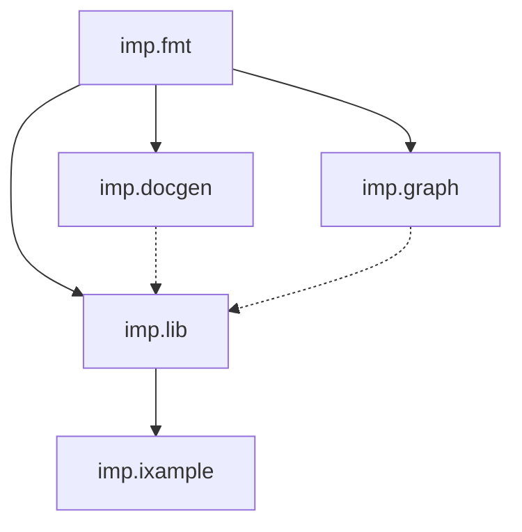

# imp.devspace

Multi-repo workspace for the imp Nix ecosystem.

## Packages



| Package       | Description                                              |
| ------------- | -------------------------------------------------------- |
| `imp.fmt`     | Standalone opinionated treefmt-nix formatter             |
| `imp.docgen`  | API doc generator (Rust CLI + Nix lib)                   |
| `imp.graph`   | Interactive dependency graph (Rust/WASM)                 |
| `imp.lib`     | Core library + flake-parts module                        |
| `imp.ixample` | Example NixOS config consumer flake of the imp ecosystem |

Solid arrows = build-time deps. Dashed = optional.

## Development testing

Test changes across repos before committing/pushing using `--override-input`, e.g. `nix flake check --override-input imp-fmt path:../imp.fmt`

## Guidelines

- `git add` untracked files before nix evals (new files only, not necessary for edits)
- Local dev refs go in `tmp/` (gitignored)
- See [docs/documentation-style/guide.md](./docs/documentation-style/guide.md) for prose style

## imp `__` patterns

Registry modules can declare special `__`-prefixed attrs that imp collects and processes:

| Pattern      | Purpose                                                                               |
| ------------ | ------------------------------------------------------------------------------------- |
| `__inputs`   | Flake inputs required by module. Collected into `flake.nix` via `nix run .#imp-flake` |
| `__overlays` | Nixpkgs overlays. String paths like `"foo.overlays.default"` reference inputs         |
| `__module`   | The actual NixOS/HM module when using functor pattern                                 |
| `__functor`  | Makes attrset callable; receives `{ inputs, ... }` for input access                   |

Example with external input:

```nix
{
  __inputs = {
    foo.url = "github:org/foo";
    foo.inputs.nixpkgs.follows = "nixpkgs";
  };

  __functor = _: { inputs, ... }: {
    __module = { pkgs, ... }: {
      # inputs.foo available here
    };
  };
}
```

For self-contained overlays, prefer `pkgs.extend` over `__overlays`:

```nix
nurPkgs = pkgs.extend inputs.nur.overlays.default;
```
